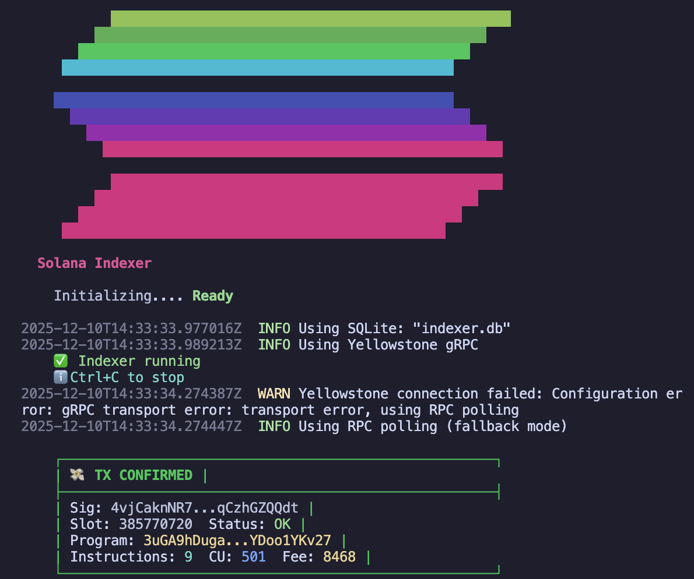
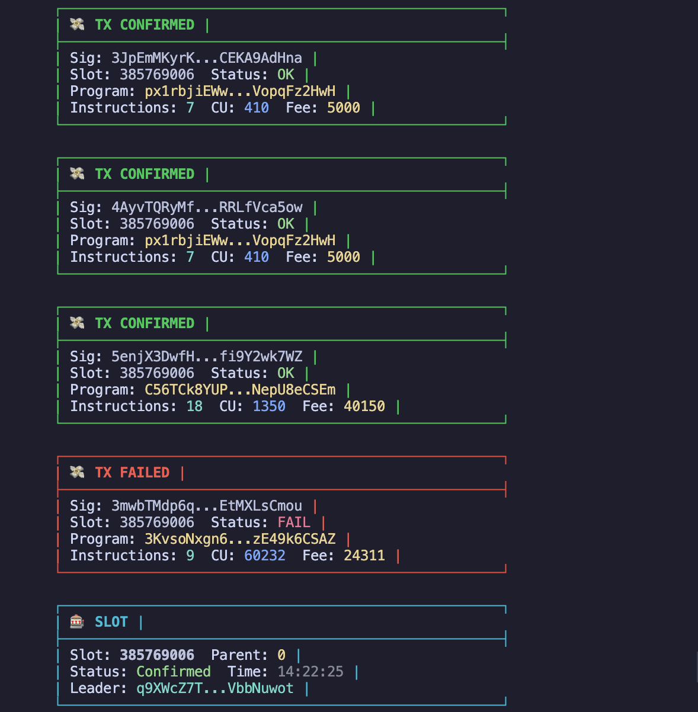
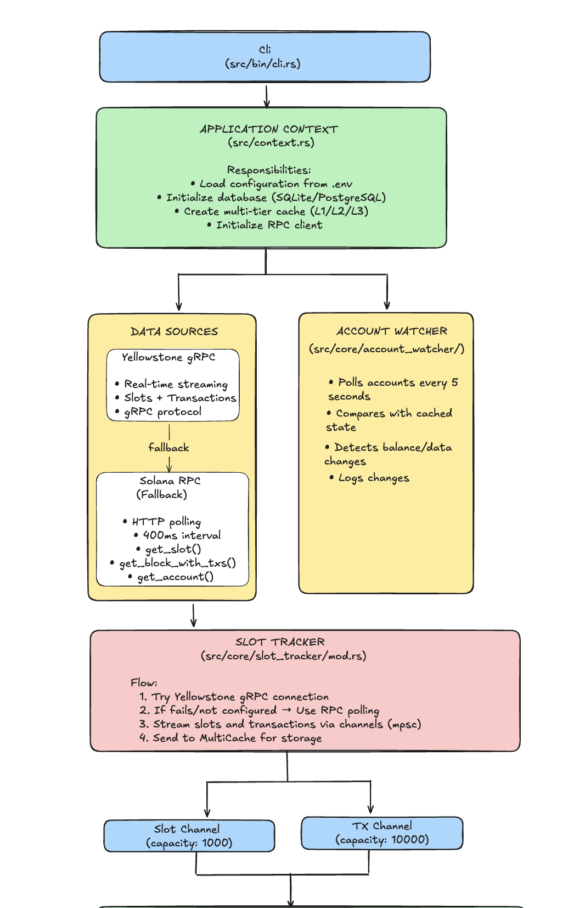
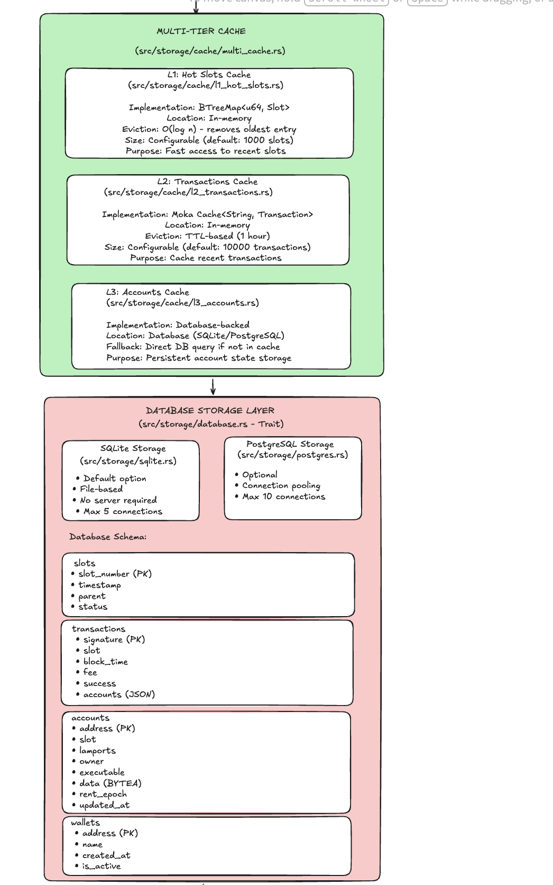
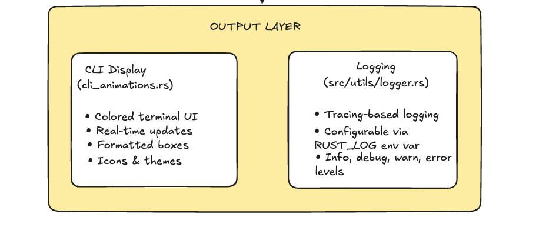

# Solana Indexer

A high-performance, production-ready Solana blockchain indexer built with Rust.
 
[](https://solana.com/)


## Demo

### Interface




## Architecture




## Features

- **Real-Time Indexing**: Stream slots and transactions via Yellowstone gRPC or RPC polling
- **Multi-Tier Caching**: L1 (hot slots), L2 (transactions), L3 (accounts) for optimal performance
- **Dual Database Support**: SQLite (default) or PostgreSQL
- **Account Monitoring**: Watch specific accounts for balance/data changes
- **Wallet Management**: Add, remove, and track wallets
- **Beautiful CLI**: Terminal UI
- **Production Ready**: Error handling, logging, and graceful fallbacks

## Installation

### Prerequisites

- Rust 1.70+ ([install](https://rustup.rs/))
- SQLite (default) or PostgreSQL

### Build

```bash
git clone <repo-url>
cd solana-indexer

# Build
cargo build 

# Set up environment
cp .env.example .env 
# Edit .env with your configuration

# Run the CLI
cargo run -- --help
```

### Start Indexer

```bash
# Start with real-time streaming (if Yellowstone configured)
cargo run -- start

# Track slots
cargo run -- track slots
cargo run -- track slots --leaders

# Add wallet
cargo run -- track wallets add -a <address> -n "My Wallet"

# List Wallet
cargo run -- track wallets list
cargo run -- track wallets list --detailed

# Wallet management
cargo run -- track wallets watch

# Remove wallet
cargo run -- track wallets remove -a <ADDRESS>

# Watch account
cargo run -- watch <ACCOUNT_ADDRESS>
```

## Tech Stack

- **Language**: Rust 2021
- **Async Runtime**: Tokio
- **gRPC**: Tonic + Yellowstone gRPC client
- **Database**: SQLx (SQLite/PostgreSQL)
- **Caching**: Moka (L2), BTreeMap (L1)
- **CLI**: Clap
- **Logging**: Tracing

### Module Breakdown

**Core Modules:**
- `context.rs` - Initializes and manages application state
- `core/types.rs` - Data structures (Slot, Transaction, AccountState, etc.)
- `core/slot_tracker/` - Main indexing orchestrator
- `core/account_watcher/` - Account change monitoring

**Data Sources:**
- `yellowstone_grpc.rs` - Real time gRPC streaming(optional) (still in-progress)
- `solana_rpc.rs` - HTTP RPC polling (fallback)

**Storage:**
- `database.rs` - Storage trait interface
- `factory.rs` - Creates SQLite or PostgreSQL storage
- `sqlite.rs` / `postgres.rs` - Database implementations
- `cache/` - Three tier caching system

**Utilities:**
- `config.rs` - Environment variable loading
- `errors.rs` - Error handling
- `logger.rs` - Logging setup
- `cli_animations.rs` - Terminal UI
- `icons.rs` / `theme.rs` - UI styling

## Contributing

Contributions welcome! Please open an issue or PR. As I’m just getting started this project will have alot of mistakes, I’d really appreciate your support in making this project even better.

---

**Built with Confusion, Powered by Errors**
**If you hate this project, bash me here [:))](https://x.com/bas_karo_anaya)**