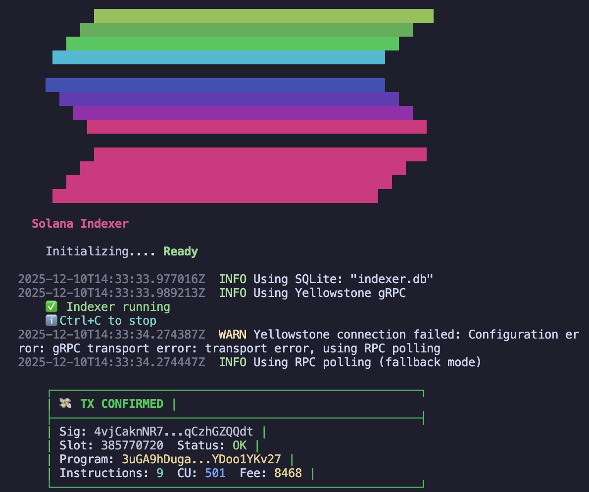
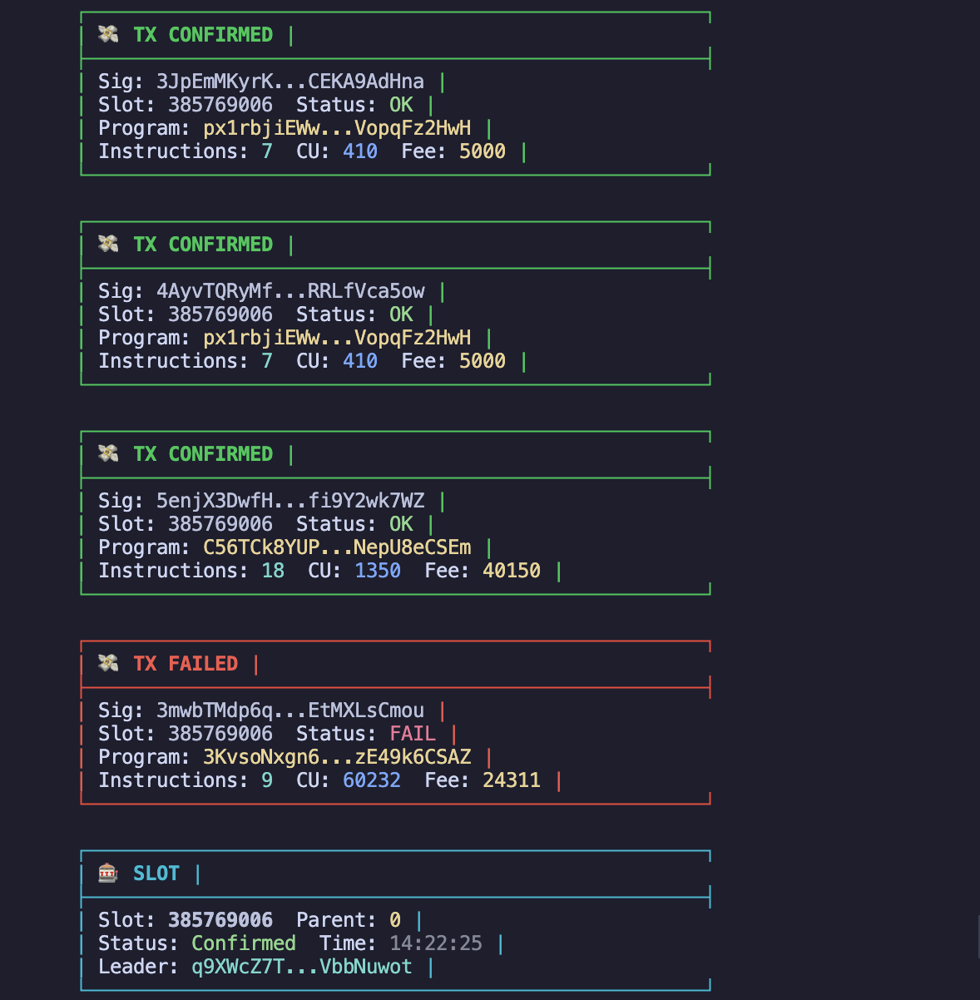
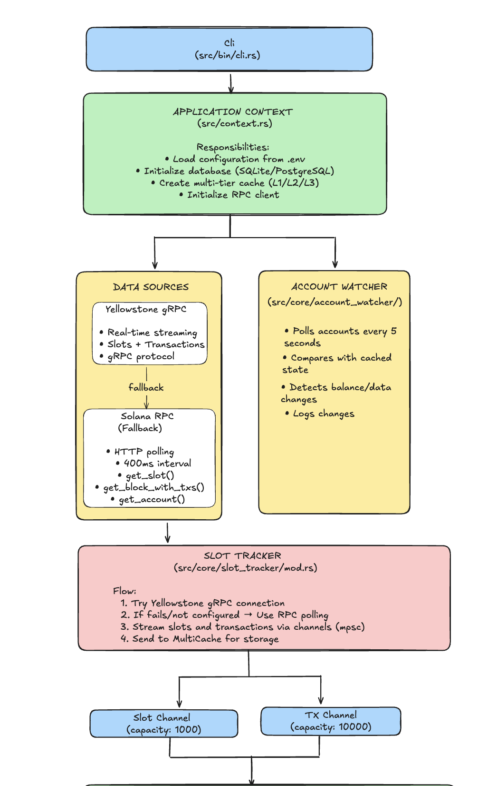
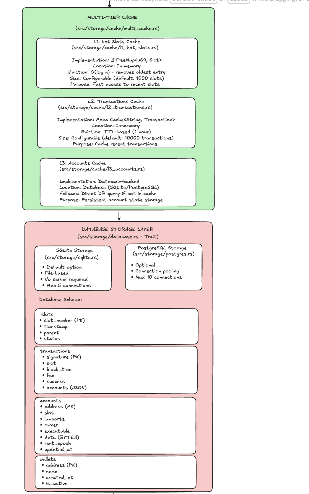
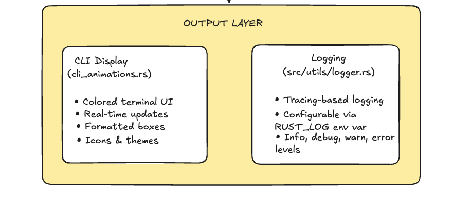

# Solana Stream Indexer

[](https://solana.com/)

[](#)
[](#)

A high-performance, Solana blockchain indexer built with Rust. Streams slots via Yellowstone gRPC (with RPC fallback), persists to PostgreSQL, and exposes a CLI + HTTP query API over a multi-tier cache.


## 🖥️ Demo

### Live Demo
- **API:** https://solana-stream-indexer-demo.fly.dev/health
- **Latest slot:** `curl -H "X-API-Key: YOUR_KEY" https://solana-stream-indexer-demo.fly.dev/slots/latest`
- See [docs/DEMO.md](docs/DEMO.md) for deployment instructions. CLI reference: [docs/COMMANDS.md](docs/COMMANDS.md).

### Interface




## 🏗️  Architecture




## Features

- **Real-time indexing** — Yellowstone gRPC primary, RPC fallback (400ms polling)
- **Multi-tier cache** — L1 slots, L2 transactions (1h TTL), L3 accounts
- **Dual database** — SQLite (local) or PostgreSQL / Supabase (hosted)
- **Parallel account monitoring** — active wallets + `WATCH_ACCOUNTS` on `start`
- **CLI + HTTP API** — query indexed slots, transactions, and accounts
- **Graceful shutdown** — Ctrl+C stops all tasks cleanly
- **Deploy-ready** — Dockerfile + Fly.io config included


## 📦 Installation

### Prerequisites

- Rust 1.70+ ([install](https://rustup.rs/))
- SQLite (default) or PostgreSQL

### Build

```bash
git clone <repo-url>
cd solana-indexer

# Build
cargo build 

# Set up environment
cp .env.example .env
# Edit .env — set SOLANA_RPC_URL (and optionally YELLOWSTONE_GRPC_URL)

cargo run -- --help
# Or after release build:
# ./target/release/solana-stream-indexer --help
```

### 🎯 Start Indexer

```bash
cargo run -- start
cargo run -- query latest
cargo run -- serve
```
Full CLI and HTTP API reference: **[docs/COMMANDS.md](docs/COMMANDS.md)**
<!-- 
```bash
# Start with real-time streaming (if Yellowstone configured)
cargo run -- start

# Track slots
cargo run -- track slots
cargo run -- track slots --leaders

# Add wallet
cargo run -- track wallets add -a <address> -n "My Wallet"

# List Wallet
cargo run -- track wallets list
cargo run -- track wallets list --detailed

# Wallet management
cargo run -- track wallets watch

# Remove wallet
cargo run -- track wallets remove -a <ADDRESS>

# Watch account
cargo run -- watch <ACCOUNT_ADDRESS>
```
--> 

## Documentation

| Doc | Description |
|-----|-------------|
| [docs/COMMANDS.md](docs/COMMANDS.md) | CLI and HTTP API reference |
| [docs/DEMO.md](docs/DEMO.md) | Live deployment (Fly.io + Supabase) |

## 📦 Tech Stack

- **Language**: Rust
- **Async Runtime**: Tokio
- **gRPC**: Tonic + Yellowstone gRPC client
- **Database**: SQLx (SQLite/PostgreSQL)
- **Cache: Moka**: (L2/L3) + BTreeMap (L1)
- **HTTP API**: Axum
- **CLI**: Clap
- **Logging**: Tracing

<!-- 
### 📦 Module Breakdown

**Core Modules:**
- `context.rs` - Initializes and manages application state
- `core/types.rs` - Data structures (Slot, Transaction, AccountState, etc.)
- `core/slot_tracker/` - Main indexing orchestrator
- `core/account_watcher/` - Account change monitoring

**Data Sources:**
- `yellowstone_grpc.rs` - Real time gRPC streaming(optional) (still in progress)
- `solana_rpc.rs` - HTTP RPC polling (fallback)

**Storage:**
- `database.rs` - Storage trait interface
- `factory.rs` - Creates SQLite or PostgreSQL storage
- `sqlite.rs` / `postgres.rs` - Database implementations
- `cache/` - Three tier caching system

**Utilities:**
- `config.rs` - Environment variable loading
- `errors.rs` - Error handling
- `logger.rs` - Logging setup
- `cli_animations.rs` - Terminal UI
- `icons.rs` / `theme.rs` - UI styling
-->

## 🤝 Contributing

Contributions welcome! Please open an issue or PR. As I’m just getting started this project will have alot of mistakes, I’d really appreciate your support in making this project even better.

---

**Built with Confusion, Powered by Errors**

**If you hate this project, bash me here [:))](https://x.com/bas_karo_anaya)**
